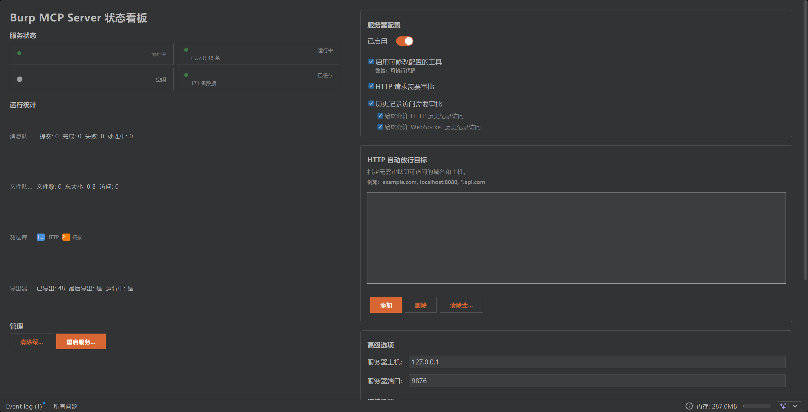

# Burp Suite MCP Server — 魔改增强版

基于 PortSwigger 官方 [mcp-server](https://github.com/PortSwigger/mcp-server) 深度魔改，解决原版的多个痛点，大幅提升 LLM 与 Burp Suite 的协作效率。

## 相比原版的改进

### 痛点解决

| 痛点                  | 原版问题                                                                                                                   | 本版改进                                                                            |
| --------------------- | -------------------------------------------------------------------------------------------------------------------------- | ----------------------------------------------------------------------------------- |
| **AI 频繁断连**      | ① 心跳机制使用自请求（HTTP GET 到自身）→ 服务忙时超时失败 → AI 判定连接死亡断连；② MCP 工具执行无超时保护 → 慢请求阻塞 Netty 事件循环 → SSE 心跳无法发送；③ Exporter 每 5s 加载全量历史 → GC 暂停冻结 | ① 心跳改用纯日志模式（SSE 保活由 Ktor/MCP SDK 原生处理）；② 所有工具调用添加 120s 超时保护；③ Exporter 改用游标增量同步（仅处理新增数据） |
| **数据查询效率低**    | 每次查询都实时调用 Burp API，大量数据时响应极慢. 每次挖漏洞 burp 会记录成百上千条数据, 原版 mcp 会让电脑卡死, 并且经常断连 | 解耦查询机制. 引入 SQLite 本地缓存 + 后台 Exporter 自动同步，**分页查询毫秒级响应** |
| **扫描结果难以获取**  | 无 scanner issue 查询能力                                                                                                  | 自动同步扫描问题到本地库，支持 `list_scanner_issues` / `get_scanner_issue_detail`   |
| **大响应阻塞**        | HTTP 响应体过大会导致整个工具调用超时                                                                                      | **异步任务队列**（`submit_task` / `get_task_result`）+ **文件队列**分块读取         |
| **远程/WSL 无法使用** | 严格的 localhost 绑定检查，非本地环境直接拒绝                                                                              | 新增**`strictLocalhost` 开关**，关闭后可在 WSL / 远程机器上正常使用                 |
| **AI 参数类型错误**   | AI 发送 `20.0` 而非 `20` 时反序列化失败                                                                                    | **`normalizeJsonElement`** 自动将浮点整数值转为整数                                 |
| **配置管理繁琐**      | 修改 auto-approve 列表必须手动操作 UI                                                                                      | 新增 4 个 MCP 工具：`add/remove/list/clear_auto_approve_target`                     |
| **无法优雅重启**      | 修改配置后必须重载整个扩展                                                                                                 | 新增**重启按钮** + `restart()` API，无需卸载扩展                                    |
| **无运行状态可见性**  | 只能看到"已启动/已停止"                                                                                                    | **实时状态仪表板**：服务器、导出器、队列、数据库状态一目了然                        |

### 新增功能一览

#### 数据缓存层 (SQLite)

- 自动将代理 HTTP 历史记录和扫描器问题缓存到本地 SQLite 数据库
- 支持分页查询、按 ID 获取详情
- 增量同步，仅拉取新增数据
- 支持清除缓存（全部 / 仅 HTTP 历史 / 仅扫描问题）

#### 后台导出器 (Exporter)

- 协程驱动的后台轮询，默认每 5 秒同步一次
- 自动去重，避免重复数据
- 支持 Burp 专业版（含扫描问题）和社区版

#### 异步任务系统

- `submit_task` — 提交后台任务，立即返回任务 ID
- `get_task_result` — 轮询任务结果
- `read_file` / `delete_file` — 管理大型响应文件
- 支持任务类型：发送 HTTP 请求、创建 Repeater 标签页、发送到 Intruder

#### 更友好的 UI

- **实时状态仪表板**：服务器、导出器、队列、数据库状态一目了然
- **中文界面**：所有 UI 文本已中文化
- **strictLocalhost 开关**：在高级选项中可关闭 localhost 限制



## 快速开始

### 前提条件

- **Java 21+**（必须，代理 JAR 编译目标为 Java 21）
- `jar` 命令可用

### 构建

```bash
git clone <your-fork-url>
cd mcp-server
./gradlew embedProxyJar
```

构建产物位于 `build/libs/burp-mcp-all.jar`，其中已内嵌 stdio 代理 JAR。

### 加载到 Burp

1. 打开 Burp Suite → Extensions 标签
2. 点击 Add → Extension Type 选 Java
3. 选择 `build/libs/burp-mcp-all.jar` → Next
4. 在 Burp 的 MCP 标签页中启用服务器

### 配置 MCP 客户端

扩展启动后在 `127.0.0.1:9876` 提供 MCP 服务。有两种连接方式：

#### 方式一：SSE 直连（简单，但可能不稳定）

```json
{
	"mcpServers": {
		"burp": {
			"url": "http://127.0.0.1:9876/sse"
		}
	}
}
```

#### 方式二：stdio 代理（推荐，更稳定）

使用内置的 `mcp-proxy-all.jar` 作为 stdio ↔ SSE 桥，MCP 客户端通过子进程通信，绕过网络连接不稳定的问题。

需要 Java 21 运行代理 JAR（如果系统默认 Java 不是 21，指定完整路径）：

```json
{
	"mcpServers": {
		"burp": {
			"command": "C:\\Users\\用户名\\.jdks\\ms-21.0.6\\bin\\java.exe",
			"args": [
				"-jar",
				"C:\\Users\\用户名\\AppData\\Roaming\\BurpSuite\\mcp-proxy\\mcp-proxy-all.jar",
				"--sse-url",
				"http://127.0.0.1:9876"
			]
		}
	}
}
```

也可以从 Burp UI 中点击 **"提取服务器代理 jar"** 获取 `mcp-proxy-all.jar` 放到自定义路径，或点击 **"安装到 Claude Desktop"** 自动配置。

> ⚠ **关于 Java 版本**：代理 JAR 要求 Java 21+。如果系统默认 `java` 版本较低，请在 `command` 中指定 JDK 21 的完整路径。可用 Gradle 工具链下载的 JDK（位置：`~/.jdks/ms-21.0.6/bin/java.exe`）或自行安装 JDK 21。

## 配置说明

| 选项                | 说明                   | 默认值      |
| ------------------- | ---------------------- | ----------- |
| 服务器主机          | 监听地址               | `127.0.0.1` |
| 服务器端口          | 监听端口               | `9876`      |
| 严格 localhost 模式 | WSL/远程环境需关闭     | 开启        |
| 启用保活心跳        | SSE 连接保活           | 开启        |
| 保活间隔            | 心跳间隔（秒）         | 30s         |
| 最大响应大小        | 单次响应上限（KB）     | 100KB       |
| HTTP 请求审批       | 发送 HTTP 请求前需确认 | 开启        |
| 历史记录访问审批    | 访问代理历史前需确认   | 开启        |

## MCP 工具清单

### 核心工具

- `send_http1_request` — 发送 HTTP/1.1 请求
- `get_proxy_http_history` — 获取代理 HTTP 历史
- `get_websocket_history` — 获取 WebSocket 历史
- `create_repeater_tab` — 创建 Repeater 标签
- `send_to_intruder` — 发送到 Intruder
- `set_editor_text` — 设置编辑器内容
- `set_selection` — 设置选中文本
- `get_collaborator_payloads` — 生成 Collaborator 负载
- `get_collaborator_interactions` — 查询 Collaborator 交互

### 数据查询工具（需缓存）

- `list_proxy_http_history` — 从本地缓存分页列出 HTTP 记录
- `get_proxy_http_detail` — 获取完整请求/响应详情
- `list_scanner_issues` — 列出扫描问题摘要
- `get_scanner_issue_detail` — 获取扫描问题完整详情
- `exporter_stats` — 查看缓存状态

### 异步任务工具

- `submit_task` — 提交后台任务
- `get_task_result` — 查询任务结果

### 文件管理工具

- `read_file` — 读取临时文件
- `delete_file` — 删除临时文件

### Auto-Approve 管理工具

- `add_auto_approve_target` — 添加自动放行目标
- `remove_auto_approve_target` — 移除自动放行目标
- `list_auto_approve_targets` — 列出所有自动放行目标
- `clear_auto_approve_targets` — 清除所有自动放行目标

### 数据库管理工具

- `clear_database` — 清除缓存（全部/HTTP 历史/扫描问题）

## 架构说明

```
┌──────────────────────────────────────────────┐
│                  Burp Suite                   │
│  ┌────────────────────────────────────────┐   │
│  │         MCP Server Extension           │   │
│  │  ┌──────┐  ┌──────────┐  ┌─────────┐  │   │
│  │  │ SSE  │  │ Message  │  │  File   │  │   │
│  │  │Server│  │  Queue   │  │  Queue  │  │   │
│  │  └──────┘  └──────────┘  └─────────┘  │   │
│  │  ┌──────────┐  ┌──────────────────┐   │   │
│  │  │Exporter  │─>│  SQLite Database │   │   │
│  │  │(后台同步) │  │  (本地缓存)      │   │   │
│  │  └──────────┘  └──────────────────┘   │   │
│  └────────────────────────────────────────┘   │
│              ▲                                │
│              │ SSE                             │
└──────────────┼────────────────────────────────┘
               │
        ┌──────┴──────┐
        │ MCP Client  │
        │ (Claude etc)│
        └─────────────┘
```

## 开发

工具定义位于 `src/main/kotlin/net/portswigger/mcp/tools/`，新增工具只需创建 Serializable 数据类并注册即可。

```kotlin
@Serializable
data class MyToolArgs(val param: String)

// 在 Tools.kt 中注册
mcpTool<MyToolArgs>("工具描述") {
    // 处理逻辑
}
```

## 更新日志

### a25fdf5 — 连接稳定性修复 & 可观测性增强

**基础设施：**
- **HealthMonitor**：3 击规则健康检查，连续 3 次失败触发自动重启，恢复后重置计数
- **日志系统**（新包 `logging/`）：`LogWriter` 持久化 JSONL 日志到 `~/.burp-mcp/logs/`，轮转保留 7 天，Burp UI + 文件双写
- **持久化自动重启**：突破 3 次重试上限，持续指数退避（1s→2s→4s→30s→...→300s）直到服务恢复
- **SSE 连接追踪**：原子计数器 + `ConcurrentHashMap` 管理 SSE 会话，每次连接/断开记录日志
- **SSE 端点重写**：Ktor 原生 SSE 替换 `mcp {}` DSL，`ServerSSESession.heartbeat` 保活，3600s 读写超时

**数据库：**
- **上下文去重**：SHA-256 `dedup_key`（method+URL）+ `hit_count`，5 分钟窗口内同 endpoint 合并
- **BLOB 存储**：`large_responses` 表替代文件系统，TTL 过期自动清理
- **数据保留**：自动清理旧数据（100K HTTP、10K 扫描问题、过期 BLOB）
- **Schema 迁移**：安全 `ALTER TABLE` 为旧数据库升级去重列

**其他：**
- **心跳机制**：纯日志模式替代自请求式 HTTP 心跳，避免自请求超时导致断连
- **工具超时**：所有 MCP 工具 120 秒超时保护
- **导出器优化**：`filter` + 游标查询替代 `dropWhile`，减少 GC 和 CPU 争抢
- **扫描问题去重**：`name+URL` 联合哈希替代纯 `name` 哈希
- **安全加固**：DNS 重绑定防护、CSP 头、浏览器请求拦截
- **新增测试**：Exporter 增量/去重测试、KtorServerManager 心跳/超时测试

**工具链迁移：**
- **MiniMax MCP → mmx-cli**：移除自定义 `mcp-minimax/` Python MCP 服务器，切换到官方 `mmx` CLI + skill
- **修复** `model_web_search.py:58` DuckDuckGo 回落硬编码代理问题（已随目录移除）
- **更新** `.mcp.json` 仅保留 burp 服务器
- **重写** `CLAUDE.md` 补充 mmx 分流约定、架构图、实现清单

### a25fdf5 — 连接稳定性修复

- **心跳机制**：移除自请求式 HTTP 心跳，改用纯日志模式，SSE 保活交由 Ktor/MCP SDK 原生处理，避免自请求超时导致 AI 断连
- **工具超时**：所有 MCP 工具调用添加 120 秒超时保护，防止慢请求阻塞 Netty 事件循环导致 SSE 连接断开
- **导出器优化**：将 `dropWhile` 改为 `filter` + 游标查询，避免每 5 秒全量加载代理历史造成 GC 暂停和 CPU 争抢
- **扫描问题去重**：使用 `name+URL` 联合哈希代替纯 `name` 哈希，减少不同 URL 同名问题的相互覆盖
- **新增测试**：Exporter 增量同步和游标去重测试、KtorServerManager 心跳和超时测试

### 29e8bc8 — UI 优化

- 新增实时状态仪表板（StatusDashboardPanel）：服务器、导出器、队列、数据库状态可视化
- UI 全面中文化，Design.kt 设计系统增强
- 新增 strictLocalhost 开关、重启按钮等配置项
- 响应式列布局组件（ResponsiveColumnsPanel）

### a2408c0 — 初始导入

- 从 [PortSwigger/mcp-server](https://github.com/PortSwigger/mcp-server) 导入原始代码
- SQLite 本地缓存层 + 后台 Exporter 增量同步
- 异步任务队列（MessageQueue + FileQueue）
- 扫描问题查询、Auto-Approve 管理、数据库管理工具
- 参数类型自动修正（normalizeJsonElement）

## 构建命令

| 命令                      | 说明             |
| ------------------------- | ---------------- |
| `./gradlew embedProxyJar` | 构建可分发的 JAR（含内嵌代理） |
| `./gradlew test`          | 运行测试                        |
| `./gradlew shadowJar`     | 仅构建 JAR 本体，不含代理      |
